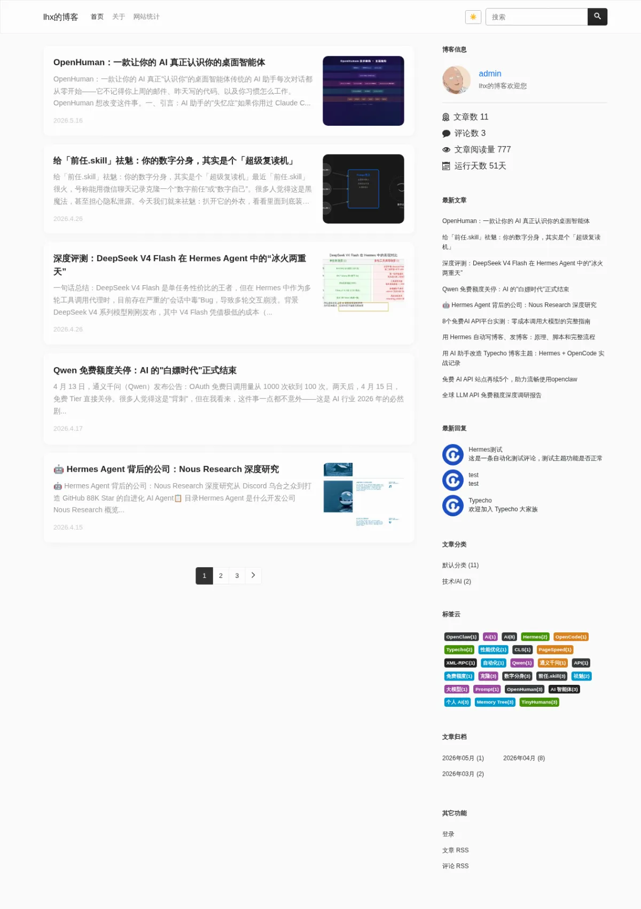
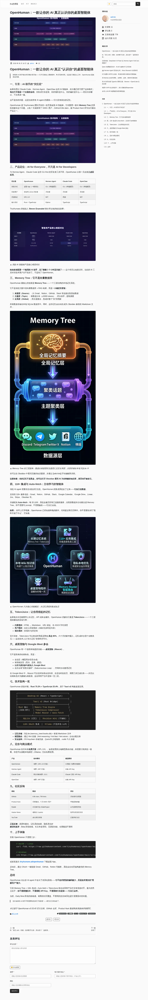

# FCLite — Typecho 博客主题

基于 [Facile 2.5](https://github.com/changbin1997/Facile) 深度修改，专注加载速度和简洁设计。

  

## 安装

在 [Releases](https://github.com/lihaoxi001/FCLite/releases) 下载最新 zip，解压到 `usr/themes/FCLite`，后台启用即可。

## 功能

- 响应式设计，桌面端/手机端自适应
- 浅色/深色两套配色（支持跟随系统主题）
- 文章列表两种样式：不显示摘要 / 显示摘要（左文字+右图）
- WebP 缩略图自动压缩（320×240，列表页封面居中裁剪）
- 文章头图支持
- 代码高亮（三套主题，30+ 语言）
- 点赞功能
- 文章目录（根据标题自动生成）
- 图片懒加载
- 评论 Emoji 表情面板
- 丰富的侧边栏组件（可排序、可开关）
- 文章分页
- PJAX 无刷新跳转
- 图表统计页面

## 文章详情页

  

## 侧边栏组件

博客信息、最新文章、最新回复、文章分类、标签云、文章归档、目录、友情链接、自定义 HTML

## WebP 缩略图

列表页封面图自动生成 320×240（4:3）居中裁剪的 WebP 缩略图，质量 85，大幅减小体积。缩略图缓存于 `assets/cache/thumbs/`，按需生成。需要 PHP GD 扩展启用 WebP 支持。

## 主题依赖

- Bootswatch — Bootstrap 主题
- jQuery — DOM 操作
- qrious — 二维码生成
- highlight.js — 代码高亮
- ECharts — 统计图表
- jquery-pjax — PJAX 无刷新跳转

## 原主题

原主题 [Facile](https://github.com/changbin1997/Facile) | 使用帮助 [facile.misterma.com](https://facile.misterma.com/)
